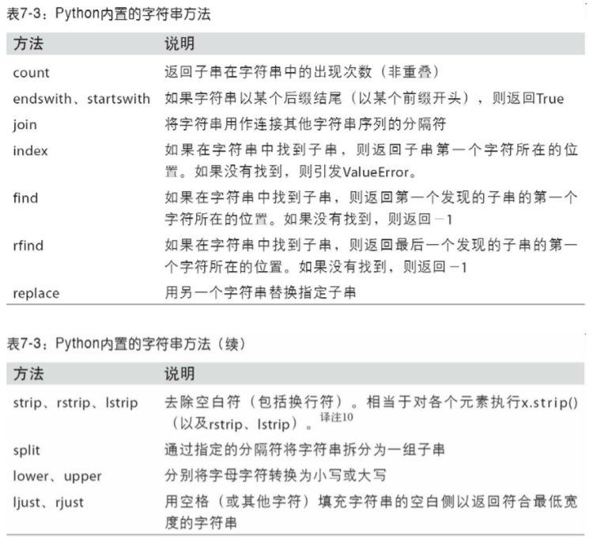
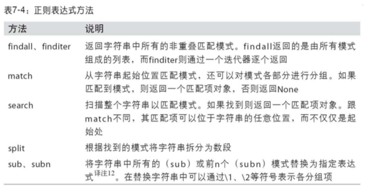

### 第 7 章 数据清洗和准备 目录
- [7.1 处理缺失数据](#7.1-处理缺失数据)
    - [简单处理](#简单处理)
    - [滤除缺失数据](#滤除缺失数据)
    - [填充缺失数据](#填充缺失数据)
- [7.2 数据转换](#7.2-数据转换)
    - [移除重复数据](#移除重复数据)
    - [利用函数或映射进行数据转换](#利用函数或映射进行数据转换)
    - [替换值](#替换值)
    - [重命名轴索引](#重命名轴索引)
    - [离散化和面元划分](#离散化和面元划分)
    - [检测和过滤异常值](#检测和过滤异常值)
    - [排列和随机采样](#排列和随机采样)
    - [计算指标/哑变量](#计算指标和哑变量)
- [7.3 字符串操作](#7.3-字符串操作)
    - [字符串对象方法](#字符串对象方法)
    - [正则表达式](#正则表达式)
    - [pandas 的矢量化字符串函数](#pandas的矢量化字符串函数)

#### 7.1-处理缺失数据

##### 简单处理
- Serise/DataFrame
    - isnull() 返回布尔类型
    - dropna 过滤缺失轴
    - fillna 填充缺失数据
    - notnull() 

##### 滤除缺失数据
- data.dropna()
    - DataFrame 默认丢弃任何含有缺失值的行
    - 参数how='all' 将只丢弃全为 NA 的那些行
    - 参数axis=1，丢弃列
    - 参数thresh 选择过滤拥有N个缺失值的数据
        - int, optional
        - Require that many non-NA values.
- data[data.notnull()]

##### 填充缺失数据
- fillna
    - 默认参数
        - int 把缺失值填充为该数据
        - dict 对应不同列填充不同的值
    - inplace=False 不修改原对象但返回，反之。。。
    - method
        - pad/ffill：用前一个非缺失值去填充该缺失值
        - backfill/bfill：用下一个非缺失值填充该缺失值
        - None: 指定一个值去替换缺失值
    - limit
        - int, 默认值 None
        - 如果指定了方法，则这是连续的NaN值的前向/后向填充的最大数量
    - axis 选择轴

#### 7.2-数据转换

##### 移除重复数据
- df.duplicated
    - 返回一个布尔型 Series
    - 表示各行是否是重复行 (前面出现过的行)
- df.drop_duplicates
    - 返回一个DataFrame，重复的数组会标为 False
- 参数list
    - 默认选择全部列，也可传入列名列表
- 参数keep
    - 默认保留的是第一个出现的值组合
    - keep='last'则保留最后一个

##### 利用函数或映射进行数据转换
- Series.str.lower() 字符转为小写
- Serise.map() 接受一个函数或者含有映射的字段对象
    - 函数是自定义函数或者是匿名函数lambda

##### 替换值
- Series.replace()
    - 被替换参数 & 替换参数 的设定
        - 接受一个替换值或是列表
        - 传入一个字典
    - 参数inplace

##### 重命名轴索引
- index.map方法
- DataFrame.rename方法
    - index
        - 接受函数对象，如str.title/str.upper
        - 接受字典
    - columns
        - 接受函数对象，如str.title/str.upper
        - 接受字典
    - inplace

##### 离散化和面元划分
- pd.cut方法
    - 返回的是一个特殊的 Categorical 对象，展示了 pandas.cut 划分的面元
        - pd.value_count(Categorical 对象) 返回统计个数
    - 首参 接受列表/Series
    - bins 接受列表
    - right 哪端是闭合端
    - labels，设置自己的面元名称
    - precision 储存标签的精度
        - int, default 3
        - The precision at which to store and display the bins labels
- pd.qcut方法
    - 根据分位数切割

##### 检测和过滤异常值
- np.sign(data)根据数据的值正负生成 1 和-1
- any()和all()
    - any()实现了或(OR)运算，而all()实现了与(AND)运算
    - any() 如果可迭代对象iterables中任意存在每一个元素为True则返回True
        - 特例：若可迭代对象为空，比如空列表[]，则返回False
    - all 如果可迭代对象iterables中所有元素都为True则返回True
        - 特例：若可迭代对象为空，比如空列表[]，则返回True

##### 排列和随机采样
-  numpy.random.permutation
    - 函数可以轻松实现对 Series 或 DataFrame 的 列的排列工作(permuting，随机重排序)
- DataFrame/Series.sample

##### 计算指标和哑变量
- pd.get_dummies
    - prefix 为变量加前缀
- pd.unique

#### 7.3-字符串操作

##### 字符串对象方法
- str.split() 切分
- str.strip() 去空白字符
- ’.‘.join(list) 合并字符
- in / str.find() 查找是否存在
- str.index 返回索引
- str.count('ss') 统计个数
- str.replace

##### 正则表达式
- re.split 正则先编译后调用split
- re.compile regex对象
    - regex.findall 查找
    - regex.start / end 返回索引
    - regex.sub 正则替代

##### pandas的矢量化字符串函数
- df.str.contains 是否包含
- df.str.findall 正则查找
- df.str.match 正则匹配
- df.str.get(1) 针对嵌套列表而言
- df.str[:5] 文本切片

