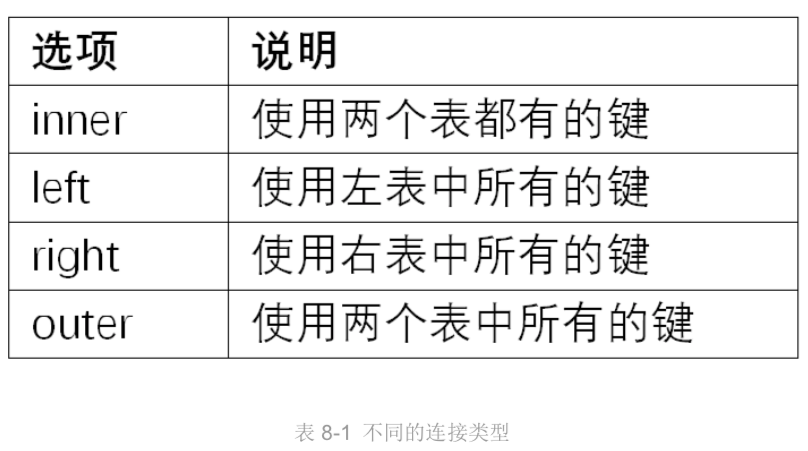
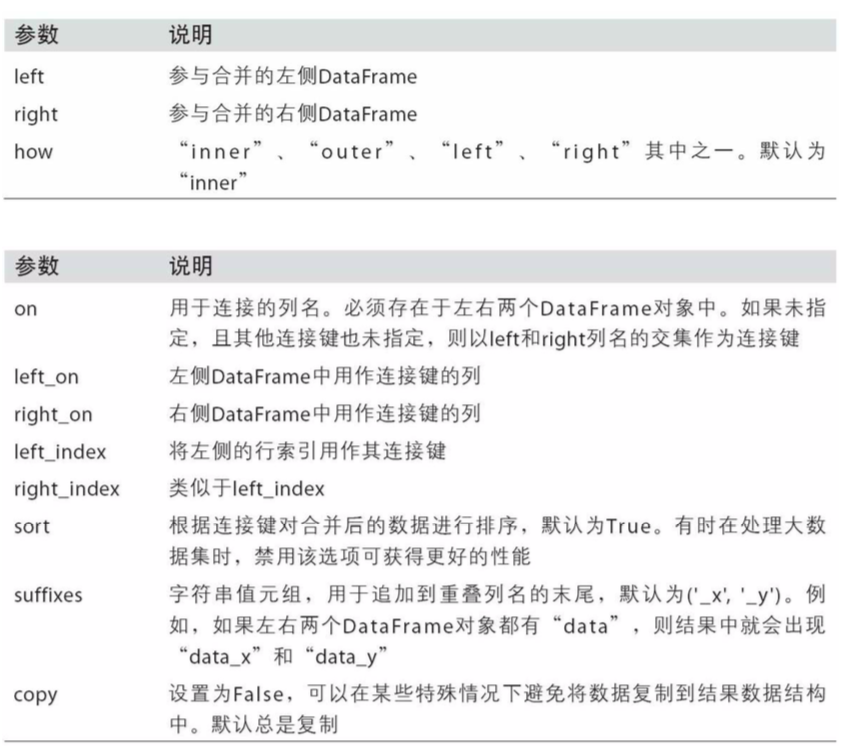
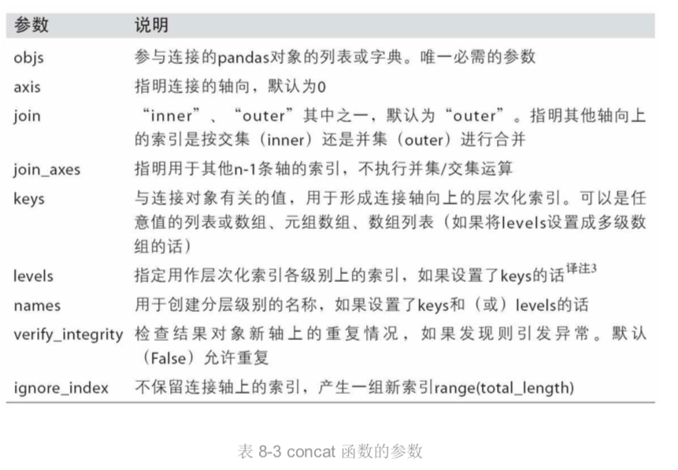

### 第 8 章 数据规整——聚合、合并和重塑
- [8.1 层次化索引](#8.1-层次化索引)
    - [概述](#概述)
    - [重排与分级排序](#重排与分级排序)
    - [根据级别汇总统计](#根据级别汇总统计)
    - [使用 DataFrame 的列进行索引](#使用DataFrame的列进行索引)
- [8.2 合并数据集](#8.2-合并数据集)
    - [数据库风格的 DataFrame 合并](#数据库风格的DataFrame合并)
    - [索引上的合并](#索引上的合并)
    - [轴向连接](#轴向连接)
    - [合并重叠数据](#合并重叠数据)
- [8.3 重塑和轴向旋转](#8.3-重塑和轴向旋转)
    - [重塑层次化索引](#重塑层次化索引)
    - [将“长格式”旋转为“宽格式”](#将“长格式”旋转为“宽格式”)
    - [将“宽格式”旋转为“长格式”](#将“宽格式”旋转为“长格式”)

#### 8.1-层次化索引
##### 概述
- 能在一个轴上拥有多个(两个以上)索引级别
- Series.unstack() 将这段数据重新安排到一个DataFrame 
- 逆运算是 df.stack

##### 重排与分级排序
- df.swaplevel 
    - 接受两个级别编号或名称，并返回一个互换了级别的新 对象(但数据不会发生变化)
- df.sort_index
    - 根据单个级别中的值对数据进行排序
    - 参数level
        - int或级别名称或int列表或级别名称列表

##### 根据级别汇总统计
- 针对常用统计方法，例如sum/mean等等，都有一个level的参数

##### 使用DataFrame的列进行索引
- df.set_index()
    - 接受单个字符或者是字符列表
    - drop=True 默认设为索引后该列被删
- df.reset_index()
    - 将索引变成一列

#### 8.2-合并数据集
##### 数据库风格的DataFrame合并
- pd.merge
    - key 如果没有指定，将重叠列的列名当做键
    - left_on / right_on
    - how 连接方式

##### 索引上的合并
- pd.merge()
    - left_index=True 或 right_index=True
        - 连接键位于其索引中 
- df.join()
    - 合并多个带有相同或相似索引的 DataFrame 对象
    - 默认使用的是左连接，保留左边表的行索引

##### 轴向连接
- 数据合并运算
    - 连接(concatenation)、
    - 绑定(binding)
    - 堆叠(stacking)
- np.concatenation
- pd.concat
    - 参数axis=0，默认合并行
    - 参数join='inner' 得到它们的交集
    - 参数join_axes 指定要在其它轴上使用的索引
    - 参数keys 在连接轴上创建一个层次化索引
    - 参数names 参数命名创建的轴级别
    - 参数ignore_index=False 缺失某列时

##### 合并重叠数据
- np.where
    - 面向数组的 if - else
- df.combine_first
    - 面向数组的 if - else, 而且实现数据对齐

#### 8.3-重塑和轴向旋转

##### 重塑层次化索引
- stack 将数据的列“旋转”为行。
- unstack 将数据的行“旋转”为列
    - 共同参数
        - 传入分层级别的编号或名称即可对其它级别进行 (un)stack 操作
        - dropna=False 是否处理缺失值

##### 将“长格式”旋转为“宽格式”
- pivot 其实就是用 set_index 创建层次化索引，再用 unstack 重塑

#### 将“宽格式”旋转为“长格式”
- pandas.melt
    - 旋转 DataFrame 的逆运算
    - 合并多个列成为一个，产生一个比输入长的 DataFrame

